```mermaid
graph TD
  %% Repo & goals
  REPO["Repo: Sensitivity Conjecture proof<br/>(LaTeX lecture + Lean formalization)"]
  GOAL["Final theorem (Lean):<br/>sensitivity(f) ≥ sqrt(degree(f))"]
  FULLCASE["Core theorem (Lean):<br/>degree(f)=n≠0 ⇒ sensitivity(f) ≥ sqrt(n)"]
  REDUCE["Reduction step (Lean):<br/>general degree → full-degree via restriction"]

  REPO --> GOAL
  FULLCASE --> GOAL
  REDUCE --> GOAL
  FULLCASE --> REDUCE

  %% Scaffolding (codebase realities, not math content)
  subgraph Scaffolding
    INF_LEAN["Lean scaffolding<br/>(Mathlib imports, options, custom tactic)"]
    AUX["Auxiliary alternative defs in Lean file<br/>(charpoly-sorted eigenvalues, interlacing predicate,<br/>min-max eigenvalue defs, Courant–Fischer inf/sup variants)"]
    INF_TEX["LaTeX scaffolding + narrative lecture notes<br/>(same proof, human exposition)"]
  end
  REPO --> INF_LEAN
  INF_LEAN --> AUX
  REPO --> INF_TEX

  %% Cube & graphs
  subgraph Cube_and_Graphs
    BC0["Hypercube vertices + enumeration<br/>x : Fin n → Bool, Finset.univ"]
    BC1["Neighbor relation / hypercube graph Q_n"]
    BC2["Induced subgraphs + degree/maxDegree"]
    BC3["Reindexing: (Fin n→Bool) ≃ Fin(2^n)<br/>and induced graph/matrix transport"]
    BC4["Dimension-splitting equivalences<br/>(needed for recursive A_n)"]
  end
  BC0 --> BC1
  BC1 --> BC2
  BC0 --> BC3
  BC1 --> BC3

  %% Sensitivity & Fourier
  subgraph Sensitivity_and_Fourier
    SEN0["Sensitivity definition"]
    CHI0["Parity character χ_S"]
    FOURIER0["Fourier coefficient f̂(S)"]
    DEG0["Degree(f) from Fourier support"]
    FULLCOEF["Full-degree witness<br/>degree(f)=n ⇒ f̂(univ)≠0"]
    DEG_WITNESS["Degree witness set S<br/>|S|=degree(f), f̂(S)≠0"]
  end
  BC0 --> SEN0
  BC1 --> SEN0
  BC0 --> CHI0
  CHI0 --> FOURIER0
  BC0 --> FOURIER0
  FOURIER0 --> DEG0
  DEG0 --> FULLCOEF
  DEG0 --> DEG_WITNESS

  %% Restriction machinery (for the general-degree reduction)
  subgraph Restriction_Machinery
    RESTRICT0["Restriction f|_{S,z}<br/>(freeze outside S)"]
    SENS_MONO["Sensitivity monotone under restriction<br/>s(restriction) ≤ s(f)"]
    FOURIER_AVG["Restriction-averaging for Fourier<br/>f̂(S)=avg_z ( (f|_{S,z})̂(univ) )"]
    EXIST_TOP["Exist z with top coeff ≠0<br/>if f̂(S)≠0"]
    DEG_FROM_TOP["Top coeff ≠0 ⇒ full degree<br/>degree(f|_{S,z})=|S|"]
  end
  BC0 --> RESTRICT0
  SEN0 --> SENS_MONO
  RESTRICT0 --> SENS_MONO
  FOURIER0 --> FOURIER_AVG
  CHI0 --> FOURIER_AVG
  RESTRICT0 --> FOURIER_AVG
  DEG_WITNESS --> EXIST_TOP
  FOURIER_AVG --> EXIST_TOP
  DEG0 --> DEG_FROM_TOP
  FOURIER0 --> DEG_FROM_TOP

  %% g-transform & level sets (connect Fourier info to a large induced subgraph)
  subgraph g_Transform_and_LevelSets
    GVAL0["Signed transform g_val<br/>and nonzero sum when degree=n"]
    LEVELSETS["Level sets S_pos/S_neg<br/>one has size > 2^{n-1}"]
    NEIGH_PARITY["Neighbor parity flip<br/>x~y ⇒ χ_univ(x)=-χ_univ(y)"]
    NEIGH_RULE["Neighbor rule<br/>x~y ⇒ (g equal ↔ f differs)"]
    DEG_SENS_LEVEL["Convert sensitivity to induced degrees<br/>on the large level set"]
  end
  FULLCOEF --> GVAL0
  CHI0 --> GVAL0
  BC0 --> GVAL0
  GVAL0 --> LEVELSETS
  BC1 --> NEIGH_PARITY
  CHI0 --> NEIGH_PARITY
  NEIGH_PARITY --> NEIGH_RULE
  GVAL0 --> NEIGH_RULE
  LEVELSETS --> DEG_SENS_LEVEL
  NEIGH_RULE --> DEG_SENS_LEVEL
  BC2 --> DEG_SENS_LEVEL
  SEN0 --> DEG_SENS_LEVEL

  %% Huang matrix (the spectral gadget)
  subgraph Huang_Matrix_and_Spectrum
    HUANG_DEF["Huang matrix A_n (recursive block form)"]
    HUANG_PROP["Key properties<br/>symmetry, A_n^2=nI, trace=0"]
    HUANG_SPEC["Explicit spectrum of A_n_fin<br/>half -sqrt(n), half +sqrt(n)"]
    ABS_ADJ["|A_n| matches hypercube adjacency"]
    HUANG_REIDX["Reindex A_n to Fin(2^n)<br/>and port properties to A_n_fin"]
  end
  BC4 --> HUANG_DEF
  HUANG_DEF --> HUANG_PROP
  HUANG_PROP --> HUANG_SPEC
  HUANG_DEF --> ABS_ADJ
  BC3 --> HUANG_REIDX
  HUANG_DEF --> HUANG_REIDX
  HUANG_PROP --> HUANG_REIDX
  ABS_ADJ --> HUANG_REIDX

  %% Submatrix + induced graph bounding (bridge matrix ↔ graph)
  subgraph Submatrix_and_Graph_Bounding
    SUBMAT["Principal submatrix A_n_fin[S]"]
    IND_GRAPH["Induced hypercube graph on S<br/>(reindexed to Fin |S|)"]
    SUBMAT_BOUND["Entrywise bound<br/>|A_n_fin[S]_{ij}| ≤ 1_{Adj in induced graph}"]
  end
  HUANG_REIDX --> SUBMAT
  BC2 --> IND_GRAPH
  BC3 --> IND_GRAPH
  SUBMAT --> SUBMAT_BOUND
  IND_GRAPH --> SUBMAT_BOUND
  HUANG_REIDX --> SUBMAT_BOUND

  %% Spectral upper bound (graph degree controls spectral radius)
  subgraph Spectral_Upper_Bound
    ROWSUM_BOUND["Eigenvalue ≤ max absolute row-sum"]
    SPEC_UPPER["From adjacency bound ⇒<br/>λ_max(A_n_fin[S]) ≤ maxDegree(induced graph)"]
  end
  ROWSUM_BOUND --> SPEC_UPPER
  SUBMAT_BOUND --> SPEC_UPPER
  BC2 --> SPEC_UPPER

  %% Interlacing lower bound (large submatrix forces large eigenvalue)
  subgraph Interlacing_Lower_Bound
    RAYLEIGH["Rayleigh quotient toolkit<br/>(incl. zero-padding to submatrix)"]
    MINMAX["Courant–Fischer / min–max principle"]
    INTERLACE["Principal-submatrix interlacing<br/>λ_max(A[S]) ≥ λ_{|S|-1}(A)"]
    HUANG_SUB_LOWER["Apply interlacing + Huang spectrum<br/>|S|>2^{n-1} ⇒ λ_max(A_n_fin[S]) ≥ sqrt(n)"]
  end
  RAYLEIGH --> MINMAX
  MINMAX --> INTERLACE
  RAYLEIGH --> INTERLACE
  SUBMAT --> RAYLEIGH
  INTERLACE --> HUANG_SUB_LOWER
  HUANG_SPEC --> HUANG_SUB_LOWER

  %% Reindexing glue (ensures degrees/sensitivity compare across representations)
  subgraph Reindexing_Glue
    GRAPH_ISO["Graph/matrix isomorphisms under reindexing<br/>(degrees preserved)"]
  end
  BC3 --> GRAPH_ISO
  BC2 --> GRAPH_ISO

  %% Assemble the full-degree theorem
  LEVELSETS --> HUANG_SUB_LOWER
  HUANG_SUB_LOWER --> FULLCASE
  SPEC_UPPER --> FULLCASE
  DEG_SENS_LEVEL --> FULLCASE
  GRAPH_ISO --> FULLCASE

  %% Assemble the general-degree reduction
  EXIST_TOP --> REDUCE
  DEG_FROM_TOP --> REDUCE
  SENS_MONO --> REDUCE
  FULLCASE --> REDUCE

  %% LaTeX narrative is a dependent “view” of the same chunks
  CHI0 --> INF_TEX
  MINMAX --> INF_TEX
  HUANG_DEF --> INF_TEX
  FULLCASE --> INF_TEX
```

### Why each node is an “atomic chunk”

(Edges point from **prerequisite → thing you can understand once you know the prerequisite**.)

#### Repo & goals

* **REPO** is atomic: it’s just the umbrella “what this repository is doing,” not a mathematical claim.
* **GOAL** is atomic: it states exactly one end product (the Sensitivity Conjecture inequality).
* **FULLCASE** is atomic: it isolates one *single* theorem statement (the full-degree case) that the rest of the proof reduces to and reuses.
* **REDUCE** is atomic: it’s one strategy statement (“reduce general degree to full degree using restriction”), even though its implementation uses several lemmas—its job is singular.

#### Scaffolding

* **INF_LEAN** is atomic: it’s “the formalization environment layer” (imports, options, and the patched tactic). It doesn’t introduce mathematical content; it only enables the file to compile and proofs to run.
* **AUX** is atomic: it’s one self-contained theme—*alternate definitions/interfaces* (charpoly-root eigenvalues, interlacing predicate, min–max definitions) that exist in the file but don’t drive the final proof.
* **INF_TEX** is atomic: it’s the human-readable exposition layer (macros + narrative). It’s not a new mathematical dependency; it’s a “view” of the same concepts.

#### Cube & graphs

* **BC0** is atomic: it introduces the universe of discourse and the ability to sum/average over it (the Boolean cube as `Fin n → Bool` with `Finset.univ`).
* **BC1** is atomic: it introduces exactly one relation/structure—“neighbors” / hypercube graph adjacency.
* **BC2** is atomic: it introduces exactly one graph operation and its two statistics—induced subgraph + degrees/maxDegree.
* **BC3** is atomic: it’s the single bridge from “functions `Fin n → Bool`” to “an indexed finite type `Fin (2^n)`,” letting matrices/graphs be reindexed without changing meaning.
* **BC4** is atomic: it exists for exactly one purpose—support the recursive block definition of the Huang matrix (splitting an (n+1)-cube into two n-cubes).

#### Sensitivity & Fourier

* **SEN0** is atomic: one definition (sensitivity as a max over Hamming-distance-1 neighbors that flip f).
* **CHI0** is atomic: one definition (parity characters χ_S), which is the basis object for Fourier analysis and the parity-flip lemma later.
* **FOURIER0** is atomic: one definition (Fourier coefficient), i.e., “how much f correlates with χ_S.”
* **DEG0** is atomic: one definition (degree is the maximum |S| with nonzero coefficient).
* **FULLCOEF** is atomic: one implication (“degree=n forces the top coefficient at univ to be nonzero”), which is exactly what you need to make the later “g has nonzero mean” step go through.
* **DEG_WITNESS** is atomic: one existence statement (“there is a support set S achieving the degree”)—it’s the unique interface you need for the restriction-based reduction.

#### Restriction machinery

* **RESTRICT0** is atomic: one construction (“freeze outside S using z”), producing a smaller-dimensional Boolean function.
* **SENS_MONO** is atomic: one monotonicity fact (“restriction can’t increase sensitivity”) used only to lift bounds back to the original f.
* **FOURIER_AVG** is atomic: one averaging identity that relates f̂(S) to the top coefficient of restrictions.
* **EXIST_TOP** is atomic: one existence extraction (“if the average is nonzero, some term is nonzero”).
* **DEG_FROM_TOP** is atomic: one characterization (“nonzero top coefficient ⇒ full degree”), turning the restricted function into an input for **FULLCASE**.

#### g-transform & level sets

* **GVAL0** is atomic: one transformation *plus* its one key property in the proof: “define a ±1-valued g that inherits nonzero mean from full degree.” (This is one conceptual move: *Fourier → imbalance*.)
* **LEVELSETS** is atomic: one combinatorial consequence: “if mean ≠ 0, then the +1/-1 level sets can’t be equal, so one is larger than half.”
* **NEIGH_PARITY** is atomic: one parity fact about the cube: χ_univ flips sign along an edge.
* **NEIGH_RULE** is atomic: one equivalence that fuses the sign flip with the definition of g: along an edge, “g equal” ⇔ “f differs.”
* **DEG_SENS_LEVEL** is atomic: one bridge statement: degrees in the induced subgraph on the large level set *are literally* sensitivity counts (so maxDegree ≤ sensitivity).

#### Huang matrix & spectrum

* **HUANG_DEF** is atomic: one definition (the recursive block matrix).
* **HUANG_PROP** is atomic: one package of algebraic invariants with a single role: the minimal set of identities you need to deduce the spectrum (symmetry, square identity, trace).
* **HUANG_SPEC** is atomic: one final spectral description (“eigenvalues are ±sqrt(n) with equal multiplicity”), regardless of how many helper lemmas the Lean file needs to derive it.
* **ABS_ADJ** is atomic: one correspondence: “|A_n| is the adjacency matrix of Q_n” (the key matrix↔graph bridge).
* **HUANG_REIDX** is atomic: one transport step: “move A_n and its properties to the Fin(2^n) index world,” so it can be compared directly to induced graphs on subsets.

#### Submatrix & induced graph bounding

* **SUBMAT** is atomic: one operation (“take principal submatrix on vertex subset S”).
* **IND_GRAPH** is atomic: one construction (“take the induced hypercube graph on the same subset”), aligned to the same indexing.
* **SUBMAT_BOUND** is atomic: one inequality interface: entries of the submatrix are bounded by the induced adjacency indicator. This is the *exact* hypothesis needed for the spectral radius bound.

#### Spectral upper bound

* **ROWSUM_BOUND** is atomic: one general linear-algebra inequality (eigenvalue bounded by a row-sum).
* **SPEC_UPPER** is atomic: one specialization: “row-sum + adjacency bound ⇒ λ_max ≤ maxDegree.” (Single job: convert matrix bounds into graph-degree bounds.)

#### Interlacing lower bound

* **RAYLEIGH** is atomic: one toolkit centered on a single notion (the Rayleigh quotient), including the “support/zero-padding” relation needed to compare A and A[S].
* **MINMAX** is atomic: one principle (Courant–Fischer) giving eigenvalues as extrema over subspaces.
* **INTERLACE** is atomic: one consequence of min–max specialized to principal submatrices (a single inequality: λ_max(A[S]) ≥ λ_{|S|-1}(A)).
* **HUANG_SUB_LOWER** is atomic: one application: plug Huang’s explicit eigenvalue list into interlacing and use “|S|>half” to force √n as a lower bound.

#### Reindexing glue

* **GRAPH_ISO** is atomic: one preservation principle—reindexing doesn’t change adjacency/degree, so you can compare “the induced graph you built from the level set” with “the induced graph used in the matrix side.”

### Why this set of chunks is exhaustive for the whole repo

You have exactly two source files, and every nontrivial line belongs to one of the chunk families above:

* **`sensitivity-polynomial.tex` (LaTeX)**

  * Preamble/macros/theorem envs/TikZ: covered by **INF_TEX**.
  * “Fourier analysis” section: covered by **BC0**, **CHI0**, **FOURIER0**, **DEG0**, **FULLCOEF**.
  * “Cauchy interlace” section: covered by **RAYLEIGH**, **MINMAX**, **INTERLACE**.
  * “Sensitivity” section + hypercube graph framing: covered by **SEN0**, **BC1**, **BC2**, and the level-set bridge chunks (**GVAL0**, **LEVELSETS**, **NEIGH_RULE**, **DEG_SENS_LEVEL**).
  * “Matrices A_n/B_n, eigenvalues ±√n, main proof” sections: covered by **HUANG_DEF**, **HUANG_PROP**, **HUANG_SPEC**, **ABS_ADJ**, **HUANG_SUB_LOWER**, **SPEC_UPPER**, and the assembly **FULLCASE**.

* **`sensitivity.lean` (Lean formalization)**
  The file is essentially the same proof, but with formalization glue:

  * The huge custom tactic + `set_option` block: **INF_LEAN**.
  * Definitions `sensitivity`, `chi`, `fourier_coeff`, `degree`: **SEN0**, **CHI0**, **FOURIER0**, **DEG0**.
  * The restriction infrastructure (`restriction`, sensitivity monotonicity, Fourier averaging, existence of good restriction, degree-from-top-coeff): **RESTRICT0**, **SENS_MONO**, **FOURIER_AVG**, **EXIST_TOP**, **DEG_FROM_TOP**, assembled as **REDUCE**.
  * Hypercube graph/induced graph/reindexing definitions: **BC1**, **BC2**, **BC3**.
  * The g-transform and the “one level set is large” argument: **GVAL0**, **LEVELSETS**, **NEIGH_PARITY**, **NEIGH_RULE**, **DEG_SENS_LEVEL**.
  * Huang matrix definition and its spectral/adjacency facts: **BC4**, **HUANG_DEF**, **HUANG_PROP**, **HUANG_SPEC**, **ABS_ADJ**, **HUANG_REIDX**.
  * Principal submatrices, induced graphs on subsets, and entrywise bounds: **SUBMAT**, **IND_GRAPH**, **SUBMAT_BOUND**.
  * Spectral upper bound (`eigenvalue_le_max_row_sum` + `spectral_radius_bound`): **ROWSUM_BOUND**, **SPEC_UPPER**.
  * Min–max/interlacing chain (Rayleigh quotient, Courant–Fischer, principal-submatrix interlacing, Huang-specialized lower bound): **RAYLEIGH**, **MINMAX**, **INTERLACE**, **HUANG_SUB_LOWER**.
  * Main theorem for degree=n and the final theorem for general degree: **FULLCASE**, **GOAL**.
  * Extra/alternate definitions (`sorted_eigenvalues_list`, `interlacing` predicate, `min_max_eigenvalue`, `courant_fischer_inf_sup`): bundled in **AUX**.

That “bucket assignment” covers *all* definitions and lemmas: each one is either (1) a base object definition, (2) a single-purpose bridge between domains (Fourier→imbalance, matrix→graph, submatrix→interlacing, etc.), or (3) an assembly theorem that composes earlier bridges. Those are exactly the chunks above, and every later chunk depends only on earlier ones in the DAG, so the decomposition is both exhaustive (nothing left unassigned) and dependency-complete (nothing downstream is missing its prerequisites).
